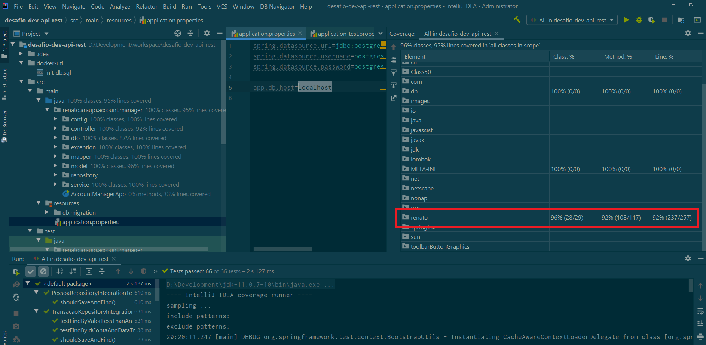

# Desafio Técnico

## Ferramentas

- Java 11
- Spring Boot 2.3.1
- Lombok
- Banco de dados PostgreSQL 12
- Flyway para alterações de banco
- Swagger
- Maven
- Docker e docker-compose

## Para rodar

Fazer build com Maven:
```
mvn package
```

Fazer build do docker:
```
docker build -t account-manager .
```

Rodar docker-composer:
```
docker-compose up
```

A aplicação estará disponível em http://localhost:8080

## Para rodar usando a IDE

- Ter plugin do Lombok instalado na IDE
- Montar projeto Maven na IDE
- Ter um banco de dados postgres disponível, configurações utilizadas (pode ser modificado no application.properties):
    - localhost:5432 (porta default)
    - usuário: postgres
    - senha: postgres
- Rodar scripts para criação do banco: docker-util/init-db.sql
- Caso queira subir somente o banco no docker (neste caso não é necessário rodar os scripts de inicialização do item anterior):
```
docker-compose -f docker-compose-only-db.yml up
```
- Rodar a aplicação: AccountManagerApp.main()

## Endpoints

Para testes no Postman, o arquivo Account Manager.postman_collection.json está disponível na raíz do projeto.

Também está disponível documentação com Swagger em: http://localhost:8080/swagger-ui/

Endpoints:
* POST /api/v1/contas - Implementar path que realiza a criação de uma conta
* POST /api/v1/transacoes/depositar - Implementar path que realiza operação de depósito em uma conta;
* GET /api/v1/contas/{idConta}/saldo - Implementar path que realiza operação de consulta de saldo em determinada conta;
* POST /api/v1/transacoes/sacar - Implementar path que realiza operação de saque em uma conta;
* PATCH /api/v1/contas/{idConta}/bloquear - Implementar path que realiza o bloqueio de uma conta;
* PATCH /api/v1/contas/{idConta}/desbloquear - Desbloquear conta;
* GET /api/v1/contas/{idConta}/extrato - Implementar path que recupera o extrato de transações de uma conta;

## Testes

Utilizei TDD para desenvolver o projeto. Cobertura:


